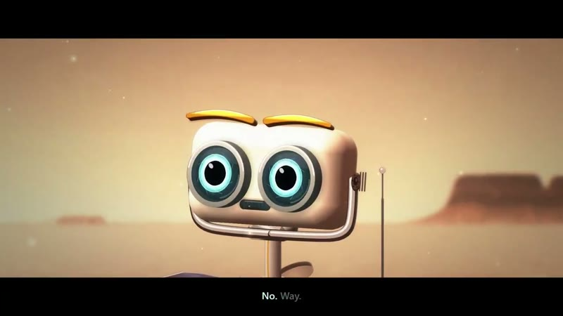
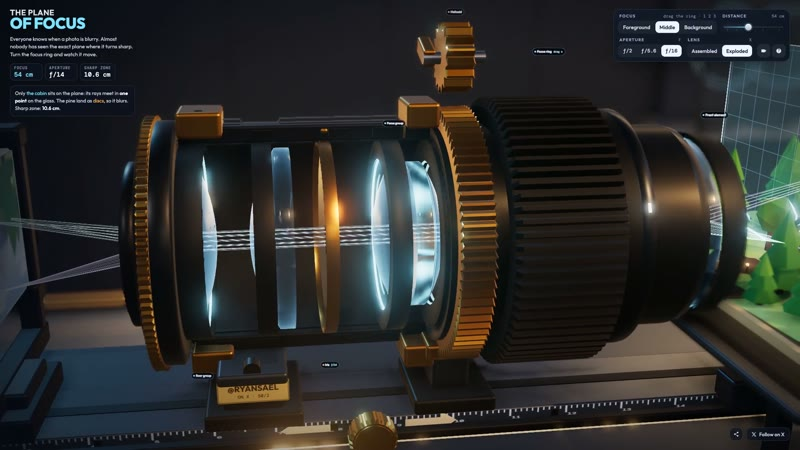
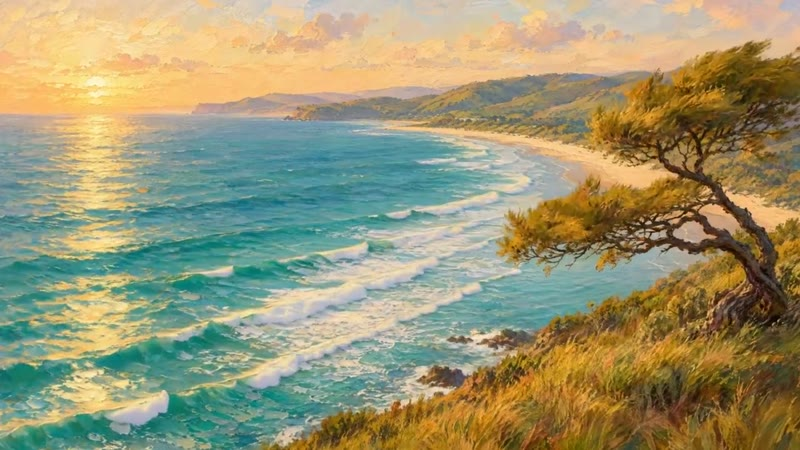
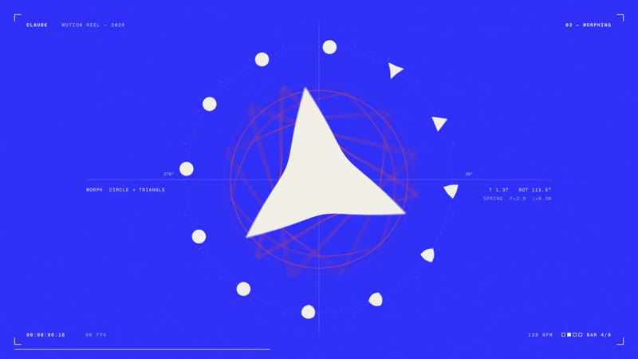
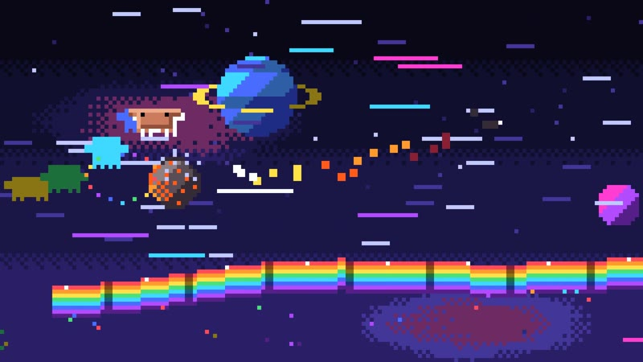
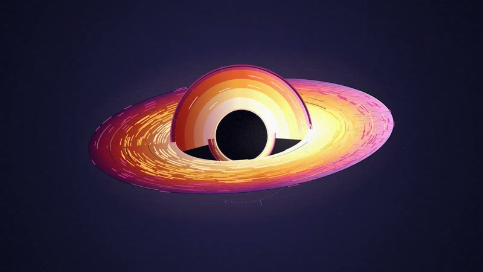
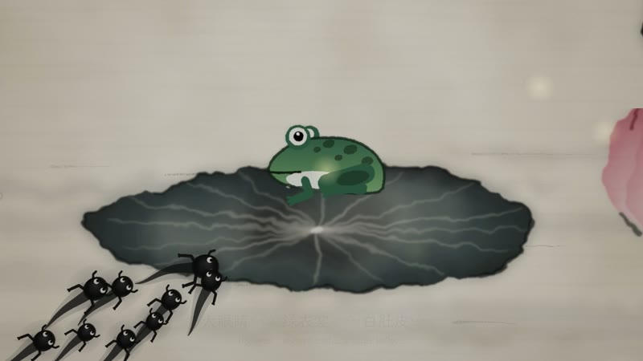
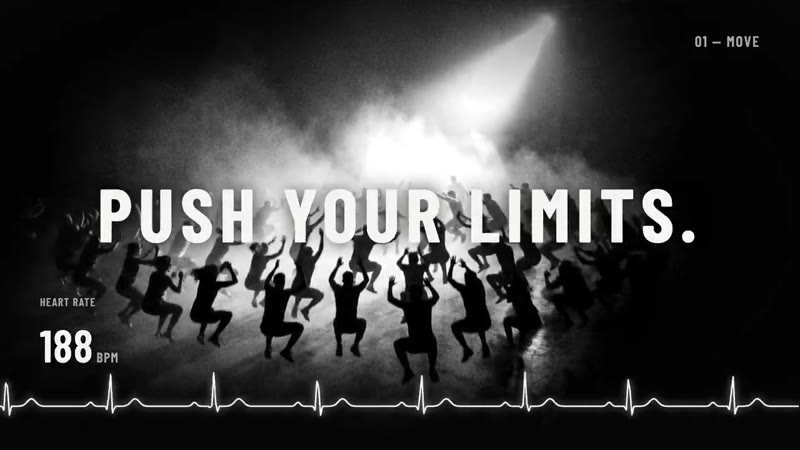

# Awesome Claude Video

[English](README.md) | [简体中文](README.zh-CN.md)

精选 Claude Opus 5.5 辅助创作的动画与视频，汇集原帖、提示词和实现方式。

<table>
  <tr>
    <td width="25%" align="center">
       
      火星探测器
    </td>
    <td width="25%" align="center">
       
      镜头实验室
    </td>
    <td width="25%" align="center">
       
      会动的海岸
    </td>
    <td width="25%" align="center">
       
      动态图形
    </td>
  </tr>
  <tr>
    <td width="25%" align="center">
       
      像素冒险
    </td>
    <td width="25%" align="center">
       
      轨道世界
    </td>
    <td width="25%" align="center">
       
      水墨动画
    </td>
    <td width="25%" align="center">
       
      运动广告
    </td>
  </tr>
</table>

[产品演示与广告](#product) · [动态图形与界面动效](#motion) · [科普教学与知识讲解](#education) · [角色与叙事动画](#stories) · [艺术、三维场景与模拟](#art) · [音乐、纪录片与视频编辑](#production) · [模型对比与测试](#comparisons)

## 产品演示与广告

### 推理服务创业公司发布解释视频

https://github.com/user-attachments/assets/0005d4cf-acdd-42aa-af16-dbebe167126d

[原帖](https://x.com/deedydas/status/2102787937482252537)

**提示词摘要:** 要求为一家推理服务创业公司制作现代、精致且节奏鲜明的发布视频。

### 把网站改版迭代汇成预告片

https://github.com/user-attachments/assets/89d8eb9f-d1cf-4006-913b-90fefc4c7e97

[原帖](https://x.com/trq212/status/2102477340920152162)

**实现方式:** 先迭代和评审多个网站改版方案，再把这些方案汇成预告片。

### Shotbase 产品发布视频

https://github.com/user-attachments/assets/19d32236-5e74-4796-8623-ef4749c2a261

[原帖](https://x.com/Miguel07Code/status/2102441708395041170)

**实现方式:** 使用 Opus 5.5 和 HyperFrames 制作产品发布视频。

### 可继续编辑的 After Effects 发布广告

https://github.com/user-attachments/assets/5bf49466-ad03-4634-a831-047b83bbf01a

[原帖](https://x.com/seiiiiiiiiiiru/status/2102636308707287201)

**实现方式:** 让 Claude 操作 Higgsfield 与 After Effects，成片仍可在 After Effects 中继续修改。

### 以旁白驱动的 After Effects 广告

https://github.com/user-attachments/assets/5688798b-626d-489d-8ad7-c31c2e6abcb9

[原帖](https://x.com/seiiiiiiiiiiru/status/2103227982592831846)

**实现方式:** 用 Gemini 3.8 Flash TTS 生成旁白，再让 Claude 在 After Effects 中编排匹配的画面、音乐和音效。

### BLVCKOUT 非官方粉丝广告

https://github.com/user-attachments/assets/46fff581-fe7e-4cbb-bfa9-275c73724384

[原帖](https://x.com/ystknsh/status/2102766871007436993)

**实现方式:** 用 MulmoCast 制作视频、Opus 编写脚本和动画、Gemini 生成图片与语音、ElevenLabs 生成音乐。

### Mole 产品宣传片

https://github.com/user-attachments/assets/6121b00b-1ad2-461d-8a62-758b6991ffde

[原帖](https://x.com/berryxia/status/2103419787565216023)

**实现方式:** 作者将输入产品、生成宣传视频的流程封装成可复用 Skill，并用 Mole 展示成片。

## 动态图形与界面动效

### 15 秒动态图形作品集

https://github.com/user-attachments/assets/50e1566c-a40d-4f6a-9cf3-246be4058b4a

[原帖](https://x.com/stephanlivera/status/2103315922098470926)

**提示词摘要:** 要求制作一支 15 秒的动态设计作品集短片，并让模型充分发挥。

### 无缝 UI 形态变换循环

https://github.com/user-attachments/assets/720d0d02-845b-4d07-b66a-99bd718f0190

[原帖](https://x.com/twoclipping/status/2103273003555402193)

**提示词摘要:** 使用原帖完整模板，让一个 HTML 场景中的 UI 按节拍连续变形，再用 Playwright 与 FFmpeg 渲染。

## 科普教学与知识讲解

### 交互式相机镜头实验室

https://github.com/user-attachments/assets/442ad7c1-0abc-4d15-964e-b558b8c82107

[原帖](https://x.com/RyanSael/status/2102591147927654847)

**提示词摘要:** 让 Opus 通过一个可交互的镜头实验室解释相机对焦。

### 研究论文变成动画讲解

https://github.com/user-attachments/assets/9a73f239-1e87-42a9-b070-1cbb8fca1c2c

[原帖](https://x.com/deedydas/status/2103141339651350646)

[实现方式](https://x.com/deedydas/status/2103142971646652607) — Claude 自行选择 Manim 制作画面、Kokoro-82m 生成旁白、FFmpeg 合成视频；作者在聊天中完成，未使用连接器。

### 人工智能发展史短片

https://github.com/user-attachments/assets/893741ba-52e4-4097-afab-ddd260bd8687

[原帖](https://x.com/kimmonismus/status/2102844654169575547)

**实现方式:** 使用 React/TypeScript 和 Remotion 制作，以 SVG、Canvas 绘图，并加入开源 TTS 旁白与 Python 合成配乐。

### 中华五千年历史速览

https://github.com/user-attachments/assets/120d98a4-47d7-43ba-81ee-7a492fa5ec0d

[原帖](https://x.com/akokoi1/status/2102583898865873225)

[Prompt](https://x.com/akokoi1/status/2102584165220962502) — 要求用轻松有趣的线稿动画快速回顾中华五千年历史，并加入合适的音乐。

### 大气环流知识讲解

https://github.com/user-attachments/assets/2c87394f-8224-4e89-bf04-36ccbe5d574f

[原帖](https://x.com/akokoi1/status/2102606609574941028)

**提示词摘要:** 提供 TTS 接口文档，要求制作讲解大气环流的线稿动画，并加入中英字幕与语音解说。

### 鸡尾酒配方动态图解

https://github.com/user-attachments/assets/a675be87-848d-4ccb-9099-38e67eeda590

[原帖](https://x.com/Ror_Fly/status/2102853258582880547)

**提示词摘要:** 根据一张参考图，用 JavaScript 或 HTML 制作 30 秒鸡尾酒配方动画，逐步展示加入的原料和用量。

### 46 秒讲解特殊相对论

https://github.com/user-attachments/assets/1f4fa300-b648-4bc8-880e-fc3a1f56ee2a

[原帖](https://x.com/masahirochaen/status/2102722719502704941)

**实现方式:** 给 Claude Code 一条参考推文和简短指令，用 Canvas 绘制 1,395 帧，再导出为 MP4。

### 奥斯特里茨战役历史短片

https://github.com/user-attachments/assets/b184c248-70ea-486a-afa8-223bdf7ff943

[原帖](https://x.com/WinterArc2125/status/2103116235009347650)

[Prompt](https://x.com/WinterArc2125/status/2103116689944502720) — 要求制作一部经过史料研究、完全由代码渲染的奥斯特里茨战役电影，并以附图画作为视觉灵感。

[实现方式](https://github.com/WinterArc21/Battle-of-Austerlitz-Film) — 仓库包含 WebGL 渲染器、地形数据、Kokoro 旁白、合成声音，以及 Chromium 到 FFmpeg 的渲染流程。

### 物理竞赛压轴题讲解

https://github.com/user-attachments/assets/de2a3655-f171-4220-9e51-ff1df27fede3

[原帖](https://x.com/akokoi1/status/2102680453912449223)

[Prompt](https://x.com/akokoi1/status/2102726335387115569) — 复用大气环流动画的提示词，把其中的知识点替换为具体物理题目。

### 真人口播转线稿动画讲解

https://github.com/user-attachments/assets/d8d0a72e-d750-48a0-b84c-1f3f6c3d2188

[原帖](https://x.com/AxtonLiu/status/2102827887732932956)

**提示词摘要:** 保留原声、字幕和时长，把主画面改成线稿 B-roll，并将说话者缩到右下角圆形画中画。

## 角色与叙事动画

### 你热爱什么？

https://github.com/user-attachments/assets/83111706-8607-496b-9faa-cb3fd969f388

[原帖](https://x.com/kevin_t_ngo/status/2102437977435893771)

### 像素巫师

https://github.com/user-attachments/assets/ea6388a4-f341-4d32-8807-8a2e7edafce0

[原帖](https://x.com/majidmanzarpour/status/2102476258948927543)

[Prompt](https://x.com/majidmanzarpour/status/2102476499387383834) — 用原生 JavaScript 和 Canvas 2D，在独立 HTML 文件中创建像素风巫师动画。

### 火星探测器短片

https://github.com/user-attachments/assets/4eee2c03-c4a7-4f51-b946-644e89045714

[原帖](https://x.com/AndrewOnXYZ/status/2102512879258009818)

### Opus 的一生

https://github.com/user-attachments/assets/542174cd-2388-4aff-8e4a-06a525083c6b

[原帖](https://x.com/shfred0/status/2102495989194236158)

**提示词摘要:** 让 Claude 从诞生开始讲述自己的一生，以 JavaScript 笔触逐帧绘制动画。

### 想象如何解决难题

https://github.com/user-attachments/assets/a8be0c0f-7129-49ca-9d0a-f02196b9e2fc

[原帖](https://x.com/chetaslua/status/2102478640428773861)

### 字里行间

https://github.com/user-attachments/assets/0dc0cb18-9c0e-4d51-a40f-334ba80a5a1b

[原帖](https://x.com/Voxyz_ai/status/2102531681450119426)

**实现方式:** 在一个 HTML 文件中用 JavaScript 绘图，通过 Hyperframes 渲染、Python 合成音乐，再逐秒检查和打磨。

### 啤酒节

https://github.com/user-attachments/assets/6b212cfe-f899-43be-9bbd-b0b21723f797

[原帖](https://x.com/cherry_mx_reds/status/2102493303388475855)

[Prompt](https://x.com/cherry_mx_reds/status/2102493305992880314) — 提供角色截图，要求制作有趣可爱的三十秒啤酒节动画，并使用本地音频采样。

### 一滴雨的故事

https://github.com/user-attachments/assets/88eeba00-42d2-4147-a77e-ab64d0522dc5

[原帖](https://x.com/aollivier82/status/2102498589259821559)

### 小蝌蚪找妈妈水墨动画

https://github.com/user-attachments/assets/0756acea-f8a7-41f0-bae4-a29f5cb4bb69

[原帖](https://x.com/akokoi1/status/2102699703309898026)

## 艺术、三维场景与模拟

### 轨道中的世界

https://github.com/user-attachments/assets/a0a1f0af-38f3-4558-8c8f-ca9031c1dd88

[原帖](https://x.com/devteamdrew/status/2102436464323661880)

### 安提基特拉机械海底探索

https://github.com/user-attachments/assets/879dd914-2191-497e-b9fd-7c71e65c4e62

[原帖](https://x.com/edwinarbus/status/2102463453176979794)

[实现方式](https://x.com/edwinarbus/status/2102463454485610511) — 在一个 HTML 文件中程序化生成 Three.js 画面与声音，再通过多轮验证完善效果。

### 投石机草图转交互模拟

https://github.com/user-attachments/assets/5acbaae6-8a88-44ba-86da-686b616097c4

[原帖](https://x.com/poolio/status/2102445641205248145)

### 彩虹路像素动画

https://github.com/user-attachments/assets/676888c5-bb90-49cb-b7a0-c8b568a71dfb

[原帖](https://x.com/riku720720/status/2102515055116063144)

[Prompt](https://x.com/riku720720/status/2102515058010132554) — 用 JavaScript 与 Canvas 2D 制作橙色像素角色在宇宙彩虹路上躲避陨石和激光的动画。

### 会动的海岸画

https://github.com/user-attachments/assets/32b24445-bc37-4e08-b81e-8b222441562e

[原帖](https://x.com/strawhatsu4/status/2102457111787745405)

### 丙烯笔触下的新西兰

https://github.com/user-attachments/assets/6d5bca54-2fc9-48ec-9439-1508be654c08

[原帖](https://x.com/ann_nnng/status/2102573127192727704)

**提示词摘要:** 将新西兰旅行照片转成丙烯画风格，再用 JavaScript 绘制。

### 蓝色光影短片测试

https://github.com/user-attachments/assets/5c5b4065-95d9-4f61-874e-acab20d73b9d

[原帖](https://x.com/RileyRalmuto/status/2102679018206052828)

### Blender 外骨骼重设计

https://github.com/user-attachments/assets/ccaac7ad-2269-40cf-8aa6-f92a06ed78f2

[原帖](https://x.com/higgsfield_ai/status/2102449278283313303)

### Blender 风车建模与动画

https://github.com/user-attachments/assets/f5ebffdb-7cd6-4e04-896b-bb6b4ca6fb67

[原帖](https://x.com/higgsfield_ai/status/2102453658889953717)

## 音乐、纪录片与视频编辑

### 我的 P(doom) 正在上升

https://github.com/user-attachments/assets/13fde54d-e7b2-4393-b519-42dc5825dd22

[原帖](https://x.com/other__reality/status/2102514581684052169)

[实现方式](https://github.com/JohnHeibel/PDoomVideo#how-it-was-made) — 用 p5.js 和 p5.brush 制作绘画动画，在无头 Chrome 中渲染帧，再通过 FFmpeg 合成视频。

[实现方式](https://github.com/JohnHeibel/PDoomVideo/blob/main/ANIMATION_GUIDE.md) — 模型编写的制作指南包含章节结构、确定性渲染、绘画函数、运动设计和画面检查方法。

### Claude Pop：混合流程音乐视频

https://github.com/user-attachments/assets/e3b65a8a-6af3-4a0a-8d62-5e9dc0ce1794

[原帖](https://x.com/donaldjewkes/status/2102801274173587569)

[Prompt](https://x.com/donaldjewkes/status/2102801469976248500) — 从参考音乐视频出发，设计角色和场景素材，叠加 JavaScript 动画与同步歌词，并反复检查画面。

### 五分钟超级智能纪录短片

https://github.com/user-attachments/assets/aa4ac9cb-8868-4c98-806e-679a78b05167

[原帖](https://x.com/gavinpurcell/status/2103304514329854102)

**提示词摘要:** 为 Claude 接入 Runway MCP，要求制作一部面向普通观众、讲解超级智能的精致纪录片。

### 从 13 条原始素材剪成发布视频

https://github.com/user-attachments/assets/0d69cbad-283b-4645-911e-24f1e4d928eb

[原帖](https://x.com/gregpr07/status/2102984873351037161)

[实现方式](https://github.com/browser-use/video-use#how-it-works) — 用 video-use 对比不同口播素材，挑选合适片段，再完成剪辑、调色、字幕和发布视频组装。

## 模型对比与测试

### Blender 程序化镜头与制作过程

https://github.com/user-attachments/assets/b99f80f5-ea56-416d-a576-fcff82e86637

[原帖](https://x.com/Stefan_3D_AI/status/2102471841046786153)

**提示词摘要:** 在 Blender 中以程序化方式创建场景，渲染十秒镜头，并记录搭建过程的延时视频。

### 史前岛屿交互场景对比

https://github.com/user-attachments/assets/9c7562a1-3943-4dbd-8396-e19155d7ed23

[原帖](https://x.com/vib3coded/status/2102450239923720440)

[Prompt](https://x.com/vib3coded/status/2102450842070569099) — 用 Three.js 和 WebGL 在一个 HTML 文件中构建可交互史前岛屿，包含关节动画与水下剖面。

### 生物模型骨骼绑定与动作

https://github.com/user-attachments/assets/6993d490-c2d8-494b-aa5b-09a759908bdc

[原帖](https://x.com/Stefan_3D_AI/status/2102641562824135022)

### 程序化动画场景重建

https://github.com/user-attachments/assets/384e51d1-0ed2-4b06-af4f-a68279b7b989

[原帖](https://x.com/Stefan_3D_AI/status/2102623690152419633)

### 润唇膏广告：Opus 与 Astra 对比

https://github.com/user-attachments/assets/94c69f64-dc4f-4897-a34c-85dca9675790

[原帖](https://x.com/higgsfield_ai/status/2102913101926731879)

**提示词摘要:** 使用给定品牌素材，在 After Effects 中制作与音乐同步的二十秒产品视频。

### 可拆解的三维眼球解剖

https://github.com/user-attachments/assets/07554def-a05f-466d-bd2a-50bfa633eb0e

[原帖](https://x.com/higgsfield_ai/status/2102536138884092185)

---

[贡献案例与更正](CONTRIBUTING.md#贡献说明) · 所有作品归原作者所有。
